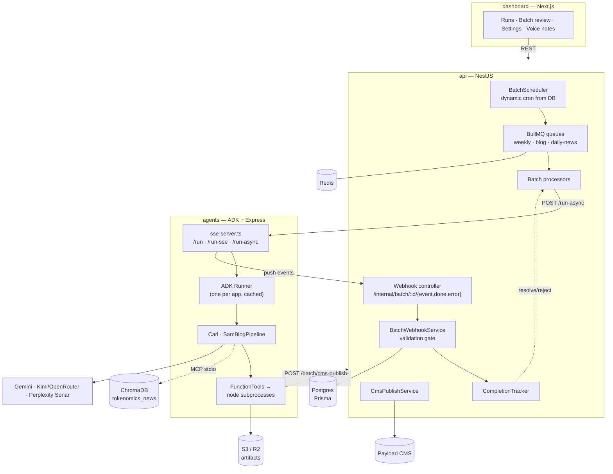
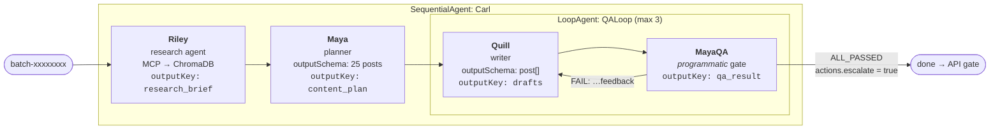
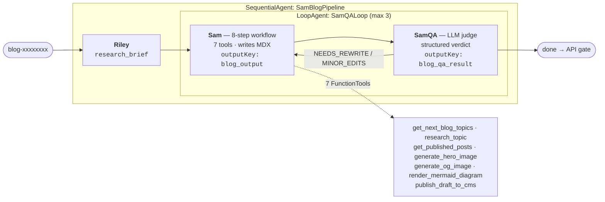
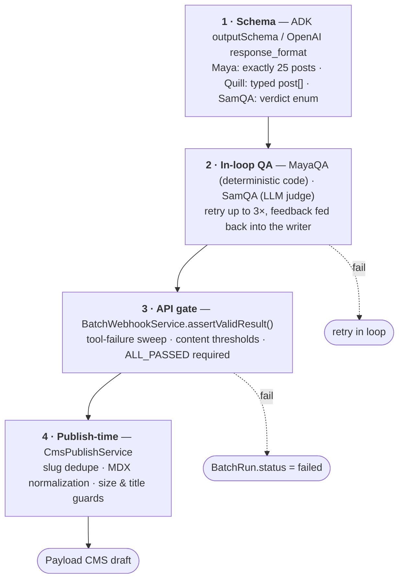
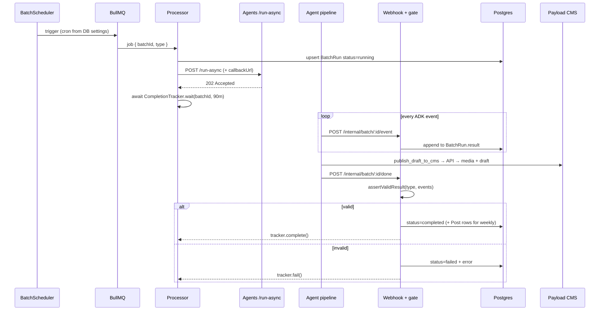

# Tokenomics.net Content System

A multi-agent content pipeline that researches, plans, writes, QA-reviews, and publishes content for Tokenomics.net — on a schedule, without a human in the loop until the review step.

Three deployable services in one repo:

```
tokenomics-content-system/
├── agents/     # Google ADK (TypeScript) agent service + custom Express/SSE runtime
├── api/        # NestJS: scheduler, BullMQ queues, validation gate, CMS publishing, Postgres
└── dashboard/  # Next.js: trigger runs, inspect traces, approve drafts, edit settings
```

---

## Table of contents

- [Architecture](#architecture)
- [How agents are spawned](#how-agents-are-spawned)
- [The orchestration graph](#the-orchestration-graph)
- [How tasks are decomposed and delegated](#how-tasks-are-decomposed-and-delegated)
- [How outputs are validated](#how-outputs-are-validated)
- [End-to-end run lifecycle](#end-to-end-run-lifecycle)
- [What actually worked and what did not](#what-actually-worked-and-what-did-not)
- [Setup](#setup)
- [Development](#development)
- [Configuration](#configuration)
- [Repo map](#repo-map)

---

## Architecture

The system is split along one hard line: **the agents service owns model calls and content generation; the API owns scheduling, durability, validation, and anything that touches production systems.** Agents never write to Postgres and never talk to the CMS directly — they call back into the API.



**Why the split matters:** a weekly run takes tens of minutes and produces hundreds of events. Keeping durability (Postgres/BullMQ) and side effects (CMS writes) on the API side means an agent crash loses a run, not data — and the agents service can be redeployed without touching the job queue.

---

## How agents are spawned

There are three distinct meanings of "spawn" in this system, and they are worth separating.

### 1. Agents as objects, not processes

Every agent is a declarative `LlmAgent` instance constructed at module load — [agents/src/agents/](agents/src/agents/). Nothing forks. Composition happens through ADK's workflow agents:

```ts
// agents/src/agent.ts
const qaLoop = new LoopAgent({ name: 'QALoop', subAgents: [quillAgent, mayaQaAgent], maxIterations: 3 });

export const rootAgent = new SequentialAgent({
  name: 'Carl',
  subAgents: [rileyAgent, mayaAgent, qaLoop],
});
```

Two root agents exist, and each is exposed as an ADK "app":

| App name | Root agent | Sub-agents | Entry |
|---|---|---|---|
| `agent` | `Carl` (SequentialAgent) | Riley → Maya → Loop(Quill ↔ MayaQA) | [agent.ts](agents/src/agent.ts) |
| `sam-pipeline` | `SamBlogPipeline` (SequentialAgent) | Riley → Loop(Sam ↔ SamQA) | [sam-pipeline.ts](agents/src/sam-pipeline.ts) |

They are lazily imported once, on first request, and cached — see `loadAgents()` in [sse-server.ts:28](agents/src/sse-server.ts#L28). One `Runner` per app is cached alongside, sharing in-memory session, artifact, and memory services.

### 2. Runs as HTTP invocations

A "spawn" at runtime is an HTTP call. The NestJS processor fires and forgets:

```
POST /run-async  { appName, userId: "system", sessionId, newMessage, callbackUrl }
  → 202 Accepted immediately
  → runner.runAsync() iterates in the background
  → every ADK event POSTed to {callbackUrl}/event
  → {callbackUrl}/done or /error at the end
```

Session identity is derived from the batch ID (`batch-<uuid8>`, `blog-<uuid8>`, `news-<uuid8>`), so the run ID, the session ID, the Postgres row, and the artifact directory on disk all share one key. That single decision is what makes traces reassemblable after the fact.

Three older entry points still exist on the same server: `/run` (blocking, returns the full event array) and `/run-sse` (SSE stream). `/run-async` superseded both — see [what didn't work](#what-actually-worked-and-what-did-not).

### 3. Real OS processes: MCP and tool subprocesses

Two things genuinely spawn processes:

- **Riley's ChromaDB access** — an `MCPToolset` with `StdioConnectionParams` launches `chroma-mcp` as a child process ([riley.ts:107](agents/src/agents/riley.ts#L107)). ADK re-spawns it per tool invocation, which turned into the single largest infrastructure problem in the project.
- **Sam's content tools** — `research_topic`, `generate_hero_image`, `generate_og_image`, `render_mermaid_diagram` all `execFile` a standalone Node script under [agents/tokenomics-seo/scripts/](agents/tokenomics-seo/scripts/) with a merged env and a hard timeout (45s–180s). The LLM never touches Perplexity, Gemini image generation, Sharp, or Puppeteer directly; it only passes arguments to a deterministic script.

### Model spawning

Model strings resolve through ADK's `LLMRegistry`. `ensureModelRegistry()` registers [KimiLlm](agents/src/agents/kimi-llm.ts), a custom `BaseLlm` that bridges any OpenAI-compatible endpoint (Moonshot direct, or OpenRouter for `kimi/*` and `google/*` model strings) into ADK's Gemini-shaped interface — including tool calling, tool-name reconciliation, and a Gemini-schema → JSON-Schema converter. Each agent reads its own env override chain, so Riley, the weekly agents, and the blog agents can run on different models:

```
RILEY_LLM_MODEL → WEEKLY_LLM_MODEL → LLM_MODEL_WEEKLY → LLM_MODEL → 'gemini-2.5-flash'
BLOG_LLM_MODEL  → BLOG_LLM_MODEL_PRO → LLM_MODEL → LLM_MODEL_PRO → 'gemini-2.5-flash'
```

---

## The orchestration graph

The graph is **static and hand-wired**. There is no planner agent deciding who runs next, no dynamic agent-to-agent handoff, no tool for delegating to another agent. Control flow is `SequentialAgent` + `LoopAgent` composition, decided at build time.

### Weekly pipeline (`agent` app)



State keys are the wiring: `research_brief` → `content_plan` → `drafts` → `qa_result`. Each downstream agent templates the upstream key into its own instruction (`{research_brief}`, `{content_plan}`, `{qa_result?}`).

### Blog pipeline (`sam-pipeline` app)



> **Known gap:** `SamQA` is prompted that `ALL_PASSED` is "the loop completion signal," but nothing in the agents service reads it as one — `actions.escalate` is set in exactly one place in the codebase, [maya-qa.ts:81](agents/src/agents/maya-qa.ts#L81). The Sam loop therefore always runs all three iterations, and `ALL_PASSED` is only enforced later, at the API gate. Costly, but not incorrect.

---

## How tasks are decomposed and delegated

Decomposition happens at four levels, none of them model-driven.

### 1. Pipeline stage — by role, fixed in code

Riley researches, Maya plans, Quill writes, MayaQA gates. Every agent's prompt ends with an explicit "What You Don't Do" section naming the other agents ("You don't write posts (Quill does). You don't decide what gets published (Maya does)"). This is prompt-level role enforcement compensating for the fact that any single agent *could* answer the whole task badly.

### 2. Work units — schema-enforced counts

Maya's `outputSchema` pins the plan to exactly 25 posts (`minItems: '25', maxItems: '25'`) split 17 LinkedIn / 5 X / 3 YouTube, plus 10+ interview prompts for Tony's voice-note session. Quill then writes **one output post per plan entry, same order, same count**. The unit of work is a slot in a posting calendar, and it is the schema — not the prompt — that holds the count.

For blogs, the work unit comes from a queue file instead: `get_next_blog_topics` reads [clusters.json](agents/tokenomics-seo/queue/clusters.json), collects everything with `status: "queued"`, sorts P0-first and pillar-before-support, and returns the top 2.

### 3. Delegation — via session state, not conversation

Every agent sets `includeContents: 'none'`. There is no shared chat history and no message passing between agents. Delegation is:

```
Agent A  --outputKey-->  session.state[key]  --{key} template-->  Agent B's instruction
```

This keeps context windows small and each agent's input reproducible, at the cost of a sharp edge that cost real debugging time — see the `afterAgentCallback` note under [what didn't work](#what-actually-worked-and-what-did-not).

### 4. Within an agent — a numbered workflow over named tools

Sam is the only agent given real freedom, and it is fenced in heavily: an 8-step ordered workflow (pick topics → research each → fetch internal links → write MDX → hero image → OG image → diagrams → publish draft → hand off), a closed list of legal tool names, and hard constraints that forbid the failure modes observed in testing:

> Never output capability disclaimers. Never stop at status/progress messages. Every turn must either call tools or return completed deliverables. Do not invent tool names. Never call an "exit", "stop", or loop-control tool.

**Run scoping:** the batch ID is passed into the prompt as a run ID, and Sam is required to forward it as `runId` to every tool that accepts it. `resolveManagedOutputDir()` in [runtime-paths.ts](agents/src/tools/runtime-paths.ts) then constrains every write to `<output-root>/runs/<runId>/…`, stripping `..`, leading slashes, and absolute paths the model may have invented. A model that hallucinates a path gets sandboxed, not obeyed.

---

## How outputs are validated

Four layers, deliberately ordered cheapest-first, and the two that matter most are not LLM-based.



### Layer 1 — schema

`outputSchema` on Maya, Quill, and SamQA. For OpenAI-compatible providers, `KimiLlm` translates the Gemini schema into `response_format: { type: 'json_schema', strict: true }`, and if a provider rejects it with a 400/422 mentioning `response_format`, it retries once without schema enforcement rather than failing the run ([kimi-llm.ts:377](agents/src/agents/kimi-llm.ts#L377)).

### Layer 2 — in-loop QA

**MayaQA is not an LLM judge.** Its instruction is a one-liner (`Output only: "QA_RUNNING"`) and the model's response is discarded. All checking runs in `afterAgentCallback` as plain TypeScript:

- exactly 25 posts, else `FAIL: Got N posts, need exactly 25`
- placeholder detection (`/this post will|see content plan|placeholder/i`)
- LinkedIn ≥ 150 words · X single ≥ 80 chars · X thread ≥ 300 chars · YouTube ≥ 800 words *and* contains `[0:00` timestamps
- on pass: `qa_result = 'ALL_PASSED'` and `context.actions.escalate = true` (the only loop exit in the system)
- on fail: a per-post failure list written back to `qa_result`, which Quill reads via `{qa_result?}` and must fix **while returning all 25 posts again**

**SamQA is an LLM judge**, because blog quality checks are genuinely fuzzy — answer-first opening word counts, 3+ external citations, 1+ attributed expert quote, 2+ sourced statistics, named framework, 40–60 word paragraphs, banned-phrase scan, frontmatter completeness. It returns a structured verdict (`ALL_PASSED | NEEDS_MINOR_EDITS | NEEDS_REWRITE`) plus per-check records with severity and a specific `fix` instruction, and it is forbidden from calling tools.

### Layer 3 — the API gate (the real gate)

When `/done` arrives, [batch-webhook.service.ts](api/src/batch/batch-webhook.service.ts) replays the entire stored event array before anything is marked complete:

- **Tool-failure sweep** — every `functionResponse` in every event is parsed (including double-encoded JSON) and any `success: false` or non-empty `error` fails the whole run. A pipeline that "finished" while its image tool silently failed does not pass.
- **Weekly** — reconstructs `drafts` from the last `stateDelta` that parses to a substantial array, requires ≥10 posts with >50 chars of real content, and requires `ALL_PASSED` to appear in some `qa_result` delta.
- **Blog** — resolves `blog_output` through a three-tier fallback: final state → last Sam text event with MDX markers and ≥1200 chars → concatenated `publish_draft_to_cms` call arguments. Then requires ≥400 chars, rejects output ending in an unresolved question (`/would you like|do you want me|should i/i`), and requires the QA verdict to be `ALL_PASSED`.

Only after passing does the run flip to `completed`, post rows get created, and the waiting BullMQ job resolves. Failure writes the reason to `BatchRun.error` and rejects the job.

### Layer 4 — publish time

[cms-publish.service.ts](api/src/batch/cms-publish.service.ts) assumes the content is still imperfect: it looks up the slug and returns the existing draft instead of duplicating; strips markdown code fences; detects and truncates a *second* frontmatter block (the model concatenating two posts into one payload); cuts trailing QA chatter (`ALL_PASSED`, `NEEDS_REWRITE`) appearing after char 1200; trims titles to 80 chars on a word boundary; rejects content under 400 or over 250,000 chars; and uploads media first, preferring the smallest available image variant to stay under upstream payload limits. Everything lands as `status: 'draft'` — publication is always a human decision in the dashboard.

The tool side adds idempotency of its own: a `.published.json` map per run short-circuits a repeat publish for the same slug.

---

## End-to-end run lifecycle



The processor's `await` is the durability seam: the BullMQ job stays alive holding the run's identity while the agent works, and a promise in `CompletionTrackerService` — resolved by an HTTP callback from a different service — is what ends it. Timeout defaults to 90 minutes (`AGENT_REQUEST_TIMEOUT_MS`).

---

## What actually worked and what did not

Written from the code and the artifacts in [agents/tmp/smoke-logs/](agents/tmp/smoke-logs/), not from memory of intentions.

### What worked

**Deterministic QA beat LLM QA, decisively.** MayaQA started as a prompted reviewer and now ignores its own model output entirely — the comment in the file says so outright: *"The LLM output is ignored entirely. All QA logic runs here, programmatically. This avoids any dependency on the model following complex formatting instructions."* Counting 25 posts and 150 words is not a judgment call, and treating it as one produced flaky loops. LLM judging was kept only where the check is genuinely qualitative (SamQA's citation/voice/GEO checklist).

**Push callbacks instead of a held-open HTTP connection.** The original design ran the pipeline over a blocking `/run` (and later an SSE stream) while the API waited. Long runs died to proxy and platform timeouts, and a dropped connection lost the entire event history. Moving to `/run-async` + `/event` + `/done` webhooks made traces durable *as they happen* — every event is in Postgres before the run finishes, so a failed run is still fully debuggable in the dashboard.

**Validating from the event trace, not the final message.** Because every event is stored, the gate can sweep all tool responses for silent failures and reconstruct `blog_output` from three different places when the final state key is empty. Trusting the last message alone would have passed several broken runs.

**Wrapping non-LLM work in subprocess tools.** Research, image generation, OG compositing, and Mermaid rendering are ordinary `.mjs` scripts invoked with arguments and a timeout. They are testable without an LLM ([tmp/run-tool-smoke.mjs](agents/tmp/run-tool-smoke.mjs) exercises all seven tools directly), and a model that produces bad arguments gets a structured `{ success: false, error }` rather than a half-written file. The Mermaid tool goes further: on a parse-like error it sanitizes HTML tags and smart punctuation and retries once, which fixed the most common class of model-authored diagram failures.

**Offloading side effects to the API.** Agents don't hold CMS credentials, don't write to Postgres, and pass blog content inline rather than by path — precisely because the two services don't share a filesystem in production. Images move by object key through S3/R2 with a filesystem-path fallback. Both are noted in-code as Railway-driven decisions, and both removed whole categories of "works locally, fails deployed."

**One ID for everything.** `batchId` = session ID = Postgres key = `runs/<runId>/` artifact directory. Every artifact from a run is trivially findable.

**A multi-provider model layer.** `KimiLlm` made it possible to switch between Gemini, Kimi, and OpenRouter-hosted models per agent via env vars, including structured output and tool calling, with a graceful downgrade when a provider rejects strict JSON schema.

### What did not work

**`adk api_server` as the production runtime.** Replaced with a hand-written Express server ([sse-server.ts](agents/src/sse-server.ts)) to get streaming, custom async endpoints, and control over session creation. The API still probes `/list-apps` and falls back across candidate app names (`agent`, `src`, `sam-pipeline`) because the app name depended on how the server was launched — a papered-over inconsistency, not a solved one.

**Prompting agents into compliance.** The smoke logs preserve the failure modes that forced today's prompt shapes:

- Riley answered with a chat greeting — *"**SYSTEMS CHECK** ✅ Riley here - all research engines are online… What's your first move?"* — instead of a brief. Hence the prompt now opens with a literal `## OUTPUT FORMAT — READ THIS FIRST` block listing INCORRECT and CORRECT first lines.
- MayaQA, when it was still an LLM judge, replied *"I need to see the actual drafts to perform the quality gate review. Please share…"* despite the drafts being in state. That log is the reason it became code.
- SamQA returned `{"verdict":"NEEDS_REWRITE","summary":"session_state.blog_output missing; cannot run checks"}` when run in isolation — correct behavior, but it shows how much of the pipeline's reliability rests on state being populated exactly as expected.

Each of these produced another paragraph of defensive prompt. That approach has a ceiling; the durable fixes were schemas and code.

**ADK's `outputSchema` interaction with downstream context.** When an agent has an `outputSchema`, ADK parses the model text into `stateDelta` and leaves the event's `parts` empty — and `getCurrentTurnContents` skips empty-parts events. The result: Quill received no user message at all and hallucinated content. Separately, template injection uses `String(value)`, so a parsed object rendered as `[object Object]`. Both are fixed by an `afterAgentCallback` on Maya that re-serializes the plan to a JSON string *and* returns it as `Content` ([maya.ts:58](agents/src/agents/maya.ts#L58)). This is a framework sharp edge, and the workaround is load-bearing.

**Model-driven loop control.** No reliable way was found to let a model end a loop. `exit_loop`-style tools were explicitly banned in Sam's prompt (a smoke test confirms Sam correctly refuses an invented `exit_loop` call), and the only working exit is MayaQA setting `actions.escalate` from code. The Sam loop has no exit condition at all and burns all three iterations on every run — a real, known cost.

**ChromaDB via MCP on constrained infrastructure.** This consumed the most deployment effort of anything in the project. ADK re-spawns `chroma-mcp` per tool call; each spawn loaded Python + chromadb + onnxruntime + a 79 MB ONNX embedding model (~300 MB), and OpenBLAS spawned 32 threads per process, hitting the platform's process limits. The fixes stack up across four commits and three files: pre-cache the ONNX model into the Docker image, run one persistent `chroma run` HTTP server from the entrypoint and point every `chroma-mcp` spawn at it with `--client-type http`, pin `OPENBLAS_NUM_THREADS=1` (plus OMP/MKL/NUMEXPR), and explicitly pass `process.env` into `StdioConnectionParams` because the MCP SDK's default "safe" env filter was dropping those very variables.

**Portable filesystem assumptions.** `resolveSeoRoot()` tries six candidate roots, `resolveOutputRoot()` tries seven, and `buildToolEnv()` merges six different `.env` files. Every one of those entries is a deployment that broke. It works, but it is the clearest signal in the codebase that the agent service's relationship to the filesystem was never properly designed.

**In-memory state everywhere it matters.** Sessions, artifacts, and memory all use ADK's `InMemory*` services, and `CompletionTrackerService` holds pending run promises in a process-local `Map`. Consequence: neither service can be scaled horizontally or restarted mid-run without orphaning the batch. Fine for one operator and a weekly cadence; a rewrite for anything more.

**Validation thresholds drifted apart.** MayaQA requires exactly 25 posts; the API gate accepts 10 of 25 with real content. The blog gate needs a three-tier fallback chain to find `blog_output` at all. Both are honest reactions to unstable model output, and both mean "completed" is a weaker claim than it looks.

**Automated testing.** There is none worth the name: the only API test is the default NestJS `Hello World!` e2e stub, and agent verification is a manual smoke harness plus checked-in replay JSON. Every regression so far was caught by reading logs.

---

## Setup

**Prerequisites:** Node 20+, PostgreSQL, Redis, Python 3 with `uv`/`uvx` (for `chroma-mcp`).

```bash
cd api && npm install && cd ..
cd agents && npm install && cd ..
cd dashboard && npm install && cd ..

# Database
cd api
cp .env.example .env        # fill in DATABASE_URL, keys
npx prisma db push
npx prisma db seed          # creates the default dashboard user
```

Seed the knowledge base Riley queries:

```bash
cd agents
npm run ingest:dry-run      # inspect chunking first
npm run ingest              # upsert into the tokenomics_news collection
```

## Development

```bash
# Agents service — custom SSE/async server on :8000
cd agents && npm run dev

# Alternatives: ADK's own runtimes for interactive debugging
cd agents && npm run dev:web    # ADK web UI
cd agents && npm run dev:api    # adk api_server
cd agents && npm run dev:cli    # single-shot CLI run

# API — :3000, prefix /api
cd api && npm run start:dev

# Dashboard — run on 3001 or 3002; the API only whitelists those origins for CORS
cd dashboard && PORT=3001 npm run dev
```

Trigger a run without waiting for cron:

```bash
curl -X POST localhost:3000/api/batch/trigger/weekly
curl -X POST localhost:3000/api/batch/trigger/blog
curl -X POST localhost:3000/api/batch/trigger/daily-news
```

Exercise all seven agent tools without an LLM:

```bash
cd agents && node build-sse.mjs && node tmp/run-tool-smoke.mjs
```

## Configuration

Schedules live in the database (`SystemConfig` singleton), not in env — edit them in the dashboard's Settings page, then `POST /api/batch/refresh-schedules` to re-register the cron jobs at runtime. Defaults: weekly Saturday 05:00, blog Tuesday 08:30, daily news 07:00.

Key environment variables:

| Service | Variable | Purpose |
|---|---|---|
| agents | `LLM_MODEL`, `RILEY_LLM_MODEL`, `WEEKLY_LLM_MODEL`, `BLOG_LLM_MODEL` | per-agent model overrides |
| agents | `GOOGLE_GENAI_API_KEY`, `KIMI_API_KEY`, `OPENROUTER_API_KEY` | provider credentials |
| agents | `CHROMA_DATA_DIR`, `CHROMA_MCP_COMMAND`, `CHROMA_HTTP_PORT` | knowledge base wiring |
| agents | `TOKENOMICS_SEO_ROOT`, `TOKENOMICS_OUTPUT_ROOT` | pin filesystem roots instead of relying on discovery |
| agents | `CONTENT_SYSTEM_API_URL`, `AGENT_PUBLISH_KEY` | calling back into the API to publish |
| agents | `OUTPUT_BUCKET_*` | S3/R2 artifact handoff |
| api | `DATABASE_URL`, `REDIS_HOST`, `REDIS_PORT`, `REDIS_PASSWORD` | persistence and queues |
| api | `AGENTS_SERVICE_URL`, `API_CALLBACK_BASE_URL`, `AGENT_REQUEST_TIMEOUT_MS` | agent service round trip |
| api | `PAYLOAD_CMS_URL`, `PAYLOAD_API_KEY` *or* `CMS_EMAIL`/`CMS_PASSWORD` | CMS publishing |
| dashboard | `NEXT_PUBLIC_API_URL`, `NEXT_PUBLIC_AGENTS_URL` | client endpoints |

## Repo map

```
agents/
  src/
    agent.ts                  # Carl — weekly root agent
    sam-pipeline.ts           # SamBlogPipeline — blog root agent
    sse-server.ts             # Express runtime: /run, /run-sse, /run-async, sessions
    agents/                   # riley, maya, quill, maya-qa, sam, sam-qa, kimi-llm
    tools/                    # 7 FunctionTools + runtime-paths (sandboxing, env, roots)
    brand/                    # voice guide, SEO checklist, image style guide, logos, fonts
    smoke-apps/               # single-agent apps for isolated testing
    scripts/ingest.py         # markdown → ChromaDB
  tokenomics-seo/
    scripts/                  # research / image / mermaid pipelines (subprocess targets)
    queue/clusters.json       # blog topic queue (P0-first, pillar-before-support)
    registry/                 # published posts, for internal linking
    output/runs/<runId>/      # per-run research, drafts, assets
  docker-entrypoint.sh        # seeds Chroma volume, starts persistent Chroma HTTP server

api/src/
  batch/                      # scheduler, queues, processors, webhook gate, CMS publish
  agents/agent-client.service.ts   # HTTP client for the agents service
  posts/  settings/  auth/  voice-notes/  prisma/
  prisma/schema.prisma        # BatchRun, Post, VoiceNote, SystemConfig, User, PostMetric

dashboard/src/app/(dashboard)/
  batch/  runs/[batchId]/  weekly-blogs/  news-reactions/
  voice-notes/  analytics/  settings/  users/
```
